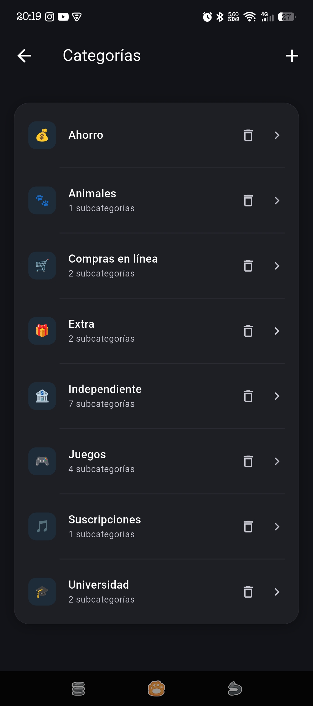
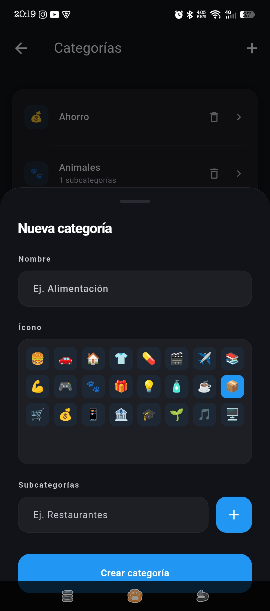
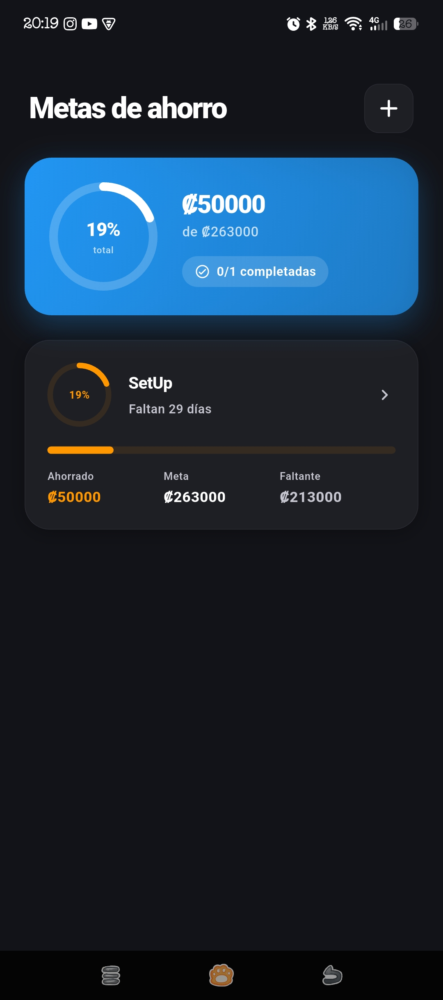
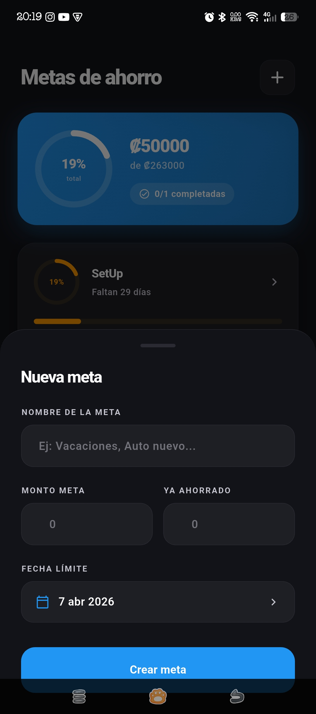
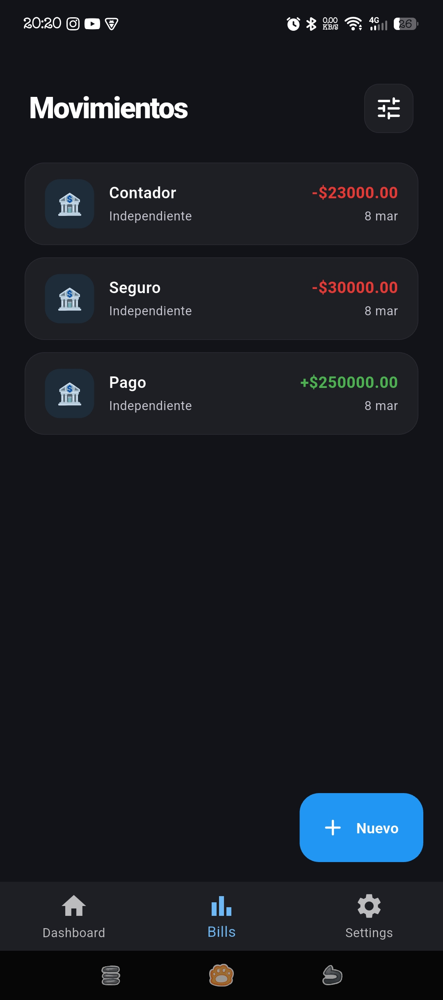
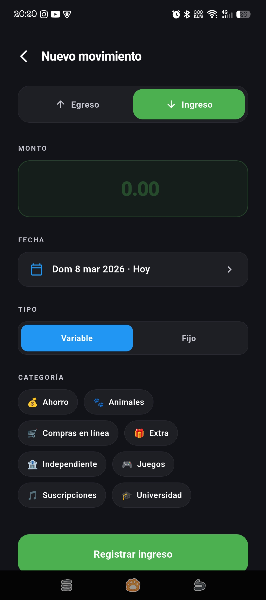
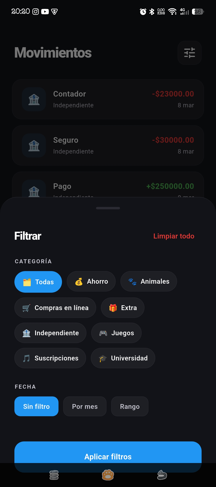
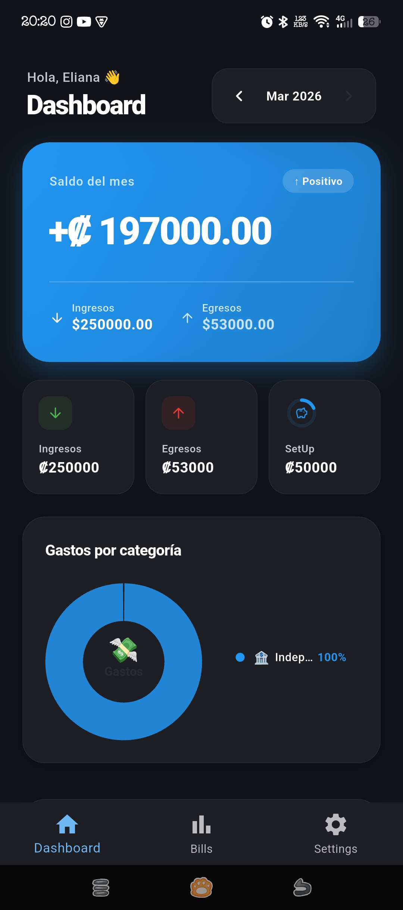
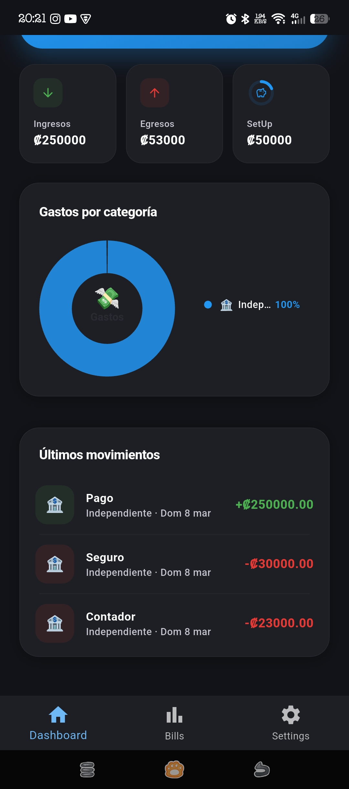

# Where Ma Money Go? 💸
A personal finance Flutter app to track income, expenses, and savings goals — with dark/light theme, Firebase backend, and BLoC + Provider architecture.

---

> ⚠️ **Note:** To use Savings Goals, you must first create a category named **"Ahorro"** (no subcategories) in Settings.

---

## Screenshots

### Categories
<p>
  
  
</p>

### Savings Goals
<p>
  
  
</p>

### Transactions
<p>
  
  
  
</p>

### Dashboard
<p>
  
  
</p>

---

## Features

| | |
|---|---|
| 🔐 **Auth** | Email/password login, registration, email verification |
| 💰 **Bills** | Log income or expenses with category, date, amount, and type |
| 🗂️ **Categories** | Custom categories with emoji icons and subcategories |
| 🐷 **Savings Goals** | Goals with progress rings, due dates, and auto-complete |
| 📊 **Dashboard** | Monthly balance, stats, donut chart, recent transactions |
| 🔍 **Filters** | Filter by category, subcategory, month, or date range |
| 🌙 **Theme** | Dark / Light mode via `ThemeProvider` |
| ⚙️ **Settings** | Manage categories and account |

---

## Tech Stack

- **Flutter** + **Dart**
- **Firebase Auth** — authentication
- **Cloud Firestore** — per-user data storage
- **flutter_bloc** — async state management
- **provider** — theme + user session

---

## Firestore Structure

```
users/{uid}/
  bills/{billId}
    → category (map), subcategory (map), amount, date, month, type, cashFlow
  categories/{categoryId}
    → name, icon, subcategories (list of maps)
  savings/{savingId}
    → name, goalAmount, currentAmount, dueDate, isCompleted, createdAt
```

### Savings ↔ Bills Logic

When saving a bill under the "ahorro" category with a goal selected:

- **Expense** → withdraws from the goal (`currentAmount -= amount`)
- **Income** → deposits into the goal (`currentAmount += amount`)
- `currentAmount` is clamped to `0.0` minimum
- Auto-marks `isCompleted = true` when `currentAmount >= goalAmount`

---

## Setup

### Prerequisites

- Flutter `>=3.0.0` / Dart `>=3.0.0`
- Firebase project with **Authentication** (Email/Password) + **Firestore** enabled
- `google-services.json` → `android/app/`
- `GoogleService-Info.plist` → `ios/Runner/`

### Install & Run

```bash
git clone https://github.com/your-org/where_ma_money_go.git
cd where_ma_money_go
flutter pub get
flutter run
```

```bash
flutter build apk --release   # Android
flutter build ios --release   # iOS
```

## Currency

Costa Rican Colón `₡` — rendered via Unicode `\u20a1`.
